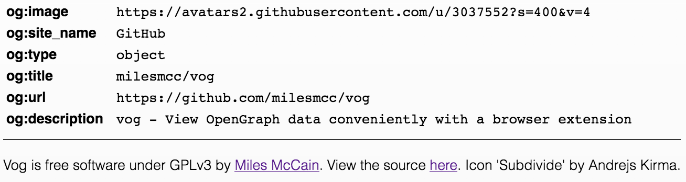

#  Vog
View OpenGraph data conveniently with a browser extension. Instead of having to go to the source page to get `og:image`, for example, you can instead just click a button in your browser.



# License
Vog is licensed under GPLv3.

```markdown
1. Anyone can copy, modify and distribute this software.
2. You have to include the license and copyright notice with each and every distribution.
3. You can use this software privately.
4. You can use this software for commercial purposes.
5. If you dare build your business solely from this code, you risk open-sourcing the whole code base.
6. If you modify it, you have to indicate changes made to the code.
7. Any modifications of this code base MUST be distributed with the same license, GPLv3.
8. This software is provided without warranty.
9. The software author or license can not be held liable for any damages inflicted by the software.
```
([source](https://gist.github.com/kn9ts/cbe95340d29fc1aaeaa5dd5c059d2e60/a59913f620010b175cb2e2eaaf75ced35245f4bc))

# Attribution
Browser icon: [Subdivide](https://thenounproject.com/search/?q=z&i=997689) by Andrejs Kirma from the Noun Project
